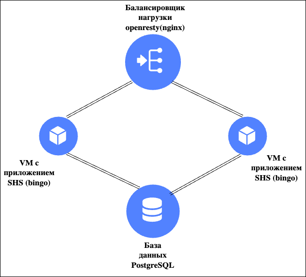

# SHS_API
## API хранилище истории сессий онлайн кинотеатра «Фильмопоиск» 
Session history storage API.  (Итоговый проект Тренировки по DevOps)

# Сервис доступен по адересу:
# [shs.netzen.dev](http://shs.netzen.dev)

## Для работы приложения используются:
### Yandex Cloud;
### compute instance group (ig);
### COI (Container Optimized Image);
### Docker;
### Openresty - fork nginx;
### PostgreSQL - база данных;
### Trraform;
### GitHub Actions.

## Схема

## Openresty

Первая ig содержит одну виртуальную машину в которой поднят контейнер с приложением openresty. Openresty используется для балансировки и кэширования трафика между vm с приложением SHS (bing). Так же он используется для доступа по протоколу HTTPS(до дедлайна поднял на nginx но пришлось отнего отказатья на openresty настроил HTTPS после дедлайна). 
Openresty был выбран по тому что open source nginx не умеет проверять доступность upstream с помощью HTTP GET запроса. Способ настройки такой проверки в Openresty позволил лучше понять структуру HTTP запроса потому что в настройка нужно было указать «сырой» запрос.
ig проверяет доступрость сервиса по ендпоиту /nginx-status каждые 30 секунд.

## Приложение SHS (bingo)

Вторая ig содержит две виртуальные машины на которых запущены контейнеры с приложением SHS.
Для запуска приложения пришлось приложить много усилий. По выаоду ошибок при запуска удалось понять в каких каталогах должет лежать конфиг файл и лог файл, необходимые директории были созданы в Docker имедже. Запуск приложения удалось ускорить заблокировав исходящие обрашения на DNS сервер Google по протоколу HTTP, так как приложение развернуто в контейнере необходимо было выбрать соответствующюю цепочку.
Для загрузки имиджа с приложение в реджистри был использован GitHub Actions, при пуше изменений в директории shs имидж собирается в GitHub Actions и пушиться в YC container registry.
ig проверяет доступрость приложения по ендпоинту /ping с 30 секундным интервалом, в лучае сбоя виртуальная машина перезагружается.
Для оперативного восстановления приложения был написан микро скрипт который каждые три секунды по ендпоинту /ping дергает приложения в случае недоступрости приложения перезагружает контейнер с приложением. Скрипт был оформлен в службу watchdog.

## PostgreSQL

Третья ig содержит одну виртуальную машину с развернутым на ней контейнером с СУБД PostgreSQL. 

## Terraform

Для автоматического деплоя приложения используется Terraform.
Создаем сервисные аккаунты для управления ig и пуленьея докер имиждей из реджисти.
Создаются ig и с помощью OCI в виртуальные машины заливаются контейнеры с соответсвующими приложениями. 
Для копирования сертификатов SSL и акаунтов доступа к БД в контейнер, использовал функцию получения переменных окружения в Terraform. 